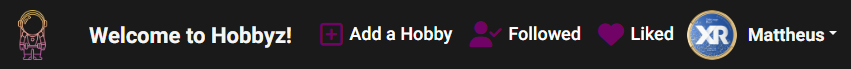
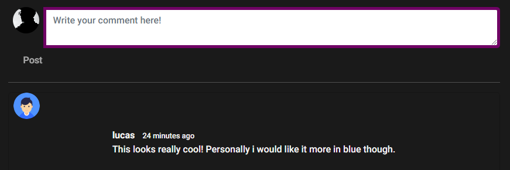
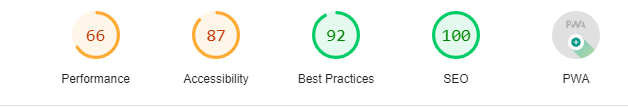

# Hobbyz
Hobbyz is a community-driven website that provides a platform for hobby enthusiasts to share their interests with like-minded people. It allows users to upload pictures of their hobbies, including but not limited to, photography, painting, knitting, cooking, and many more. Users can also comment on or like to other people's posts, creating a vibrant and engaging online community. Whether you are a seasoned hobbyist or a curious beginner, Hobbyz is the perfect place to explore your interests and connect with others who share your passion.


You can access the live version of "Hobbyz" by clicking [HERE](https://hobbyz.herokuapp.com/)

The associated API repository for this project can be found [HERE](https://github.com/MattheusKasa/hobbyz-api)

## Table of Contents
+ [UX](#ux "UX")
    + [Site Purpose](#site-purpose "Site Purpose")
    + [Site Goal](#site-goal "Site Goal")
    + [Audience](#audience "Audience")
    + [Communication](#communication "Communication")
    + [Current User Goals](#current-user-goals "Current User Goals")
    + [New User Goals](#new-user-goals "New User Goals")
    + [Future Goals](#future-goals "Future Goals")

+ [Design](#design "Design")
    + [Colour Scheme](#colour-scheme "Colour Scheme")
    + [Typography](#typography "Typography")

+ [Features](#features "Features")
    + [Existing Features](#existing-features "Existing Features")
    + [Features not yet implemented](#features-not-yet-implemented "Features not yet implemented")

+ [Testing](#testing "Testing")
    + [Validator Testing](#validator-testing "Validator Testing")

+ [Technologies](#technologies "Technologies")
    + [Languages Used](#languages-used "Languages Used")
    + [Tools and technologies utilized](#tools-and-technologies-utilized "Tools and technologies utilized")

+ [Components](#components "Components")

+ [Deployment](#deployment "Deployment")

+ [Credits](#credits "Credits")
    + [Media](#media "Media")
    + [Content](#content "Content")

## UX
---
### Site Purpose:
- To foster engagement and connection within the hobby community by allowing users to share images of their hobbies, while interacting with and supporting other users through comments and likes.

### Site Goal:
- Hobbyz aims to cultivate a thriving community where hobby enthusiasts can discover new inspirations, share their experiences, and connect with like-minded individuals.

### Audience:
- Everyone with a passion for hobbies, from beginners to experts, seeking to reach out and connect with fellow enthusiasts.

### Communication:
- The website layout is designed to be user-friendly, visually appealing, and engaging, with a straightforward navigation panel for quick access to various sections. Users can effortlessly browse through hobby-related images and interact with others by liking or commenting on their posts.

### Current User Goals:
- To ensure that users return to Hobbyz regularly to discover new content, engage with their favorite hobbyists, and stay updated on the latest posts from users they follow.

### New User Goals:
- To captivate new users, encouraging them to delve into the wide array of hobbies showcased on the site and inspire them to share their own experiences.

### Future Goals:
- Implement different user account types to control the publishing of specific content, such as featured hobby collections or tutorials.
- Introduce private messaging functionality to enable users to communicate one-on-one or with a group of users.

## Design
---
### Wireframes:

#### Main Page Unauthorised


#### Main Page


#### Create Post


#### Edit Profile


### Colour Scheme


### Typography
#### The font was sourced from the Google Fonts library. The following font was selected for the page:
- Roboto

## Features
---
### Existing Features:

#### Header:


#### Navigation


#### Posts Page:


#### Submission Form:


#### 404 Page Not Found:


#### Popular Profiles:


#### Sign-Up:


#### Sign-In:


#### Sign-Out:


#### Commenting:


#### Liking:


### Features not yet implemented:
- Notifications when a user receives a new comment, follower or like.
- Private messaging between users.
- Group messaging between users.
- Ability to block users, making it so that a user can choose to not see posts and comments from a blocked user.
- Contact form so that users can provide feedback.

## Testing
---
### Validator Testing

#### Lighthouse
- The page has a good rating in lighthouse except for in performance, this is due to the uploaded images not being properly sized, i have decided to leave this in due to not having enough time to correct it.



- The website was successfully tested for compatibility without any issues on Brave, Chrome, Safari, and a mobile device.

## Technologies
---
### Languages Used
- HTML5
- CSS3
- Javascript
- Postgres SQL

### Tools and technologies utilized
- GitPod for building the project and creating the JSX and CSS files before pushing the project to GitHub.
- GitHub for storing the repository for submission.
- Google Fonts for site fonts.
- Font Awesome to incorporate icons into the navigation sections.
- Balsamiq for creating mockups of the project before commencing.
- Favicon to provide the code and image for the icon in the tab bar.
- Am I Responsive? to verify that the project looked good across all devices.
- ReactJS to develop the components that would collectively form the front-end application.
- React-Bootstrap, a styling library, that contributed to the layout of the site.
- Django for constructing the backend database that serves as an API for the front-end project.

## Components
---
In this project, multiple components have been developed and employed consistently across the entire project:

- axiosDefault.js: Facilitates seamless communication with the backend API.
- Asset.js: Provides a loading spinner and user avatar across the website.
- DropdownEdit.js: Enables users to edit their profile.
- CurrentUserContext.js: Determines the available functionality for users based on their logged-in status.
- ProfileDataContext.js: Offers the ability to follow and unfollow other users.
- utils.js: Delivers functionality to all components utilizing Infinite Scroll.

## Deployment
---
The website has been deployed on Heroku. The deployment process involves the following steps:

1. Open the Gitpod workspace.
2. Set up ReactJS by running the following commands:
```
npx create-react-app . --use-npm
npm start
```
3. Install the required packages with `npm install`.
```
bootstrap@5.2.3
react-bootstrap@2.7.0
axios
jwt-decode@3.1.2
react-infinite-scroll-component
```
4. Add, commit, and push changes to the Gitpod repository using Git.
5. Set up the project app on Heroku and connect it to the GitHub repository by going to the "Deploy" tab.

### Connecting to the API:
1. Go to the Heroku app for the project API, and under the Settings tab, add the following config variables:
- Key: CLIENT_ORIGIN | Value: https://react-app-name.herokuapp.com
- Key: CLIENT_ORIGIN_DEV | Value: https://gitpod-browser-link.ws-eu54.gitpod.io
2. Ensure that the trailing slash is removed from the end of both links, and save the config variable pairs.
3. Install the Axios package and create a supporting `axiosDefaults.js` file.

### Deploying to Heroku:
1. In the `scripts` section of `package.json` in Gitpod, add the following command:
```
"heroku-prebuild": "npm install -g serve",
```
2. Add a Procfile to the project root and add the following:
```
web: serve -s build
```
3. Perform the git add, commit, and push steps again.
4. Deploy the project using the deploy button on Heroku.

### Deploying to ElephantSQL:
* The project has been deployed using [ElephantSQL](https://www.elephantsql.com/) by following these [instructions](https://code-institute-students.github.io/deployment-docs/41-pp5-adv-fe/pp5-adv-fe-drf-01-create-a-database).

## Credits
---
### Media:
- Images for the profile pictures and posts on the site were collected from various sources on google and pexels. The original content creators of these images are not known.
- Images for the different pages created using Canva

### Content
- Code Institute: The foundation for this project was built using the Moments walkthrough as a step-by-step guide, which was then customized and expanded upon to create a unique project.
- Font awesome for fonts.
- Programming with Mosh on Youtube.
- Web Dev Simplified on Youtube.
- Font awesome for fonts.
- Code institute Slack Channel
- Countless other YouTube videos for inspiration

[🔼 Back to top](#hobbyz)